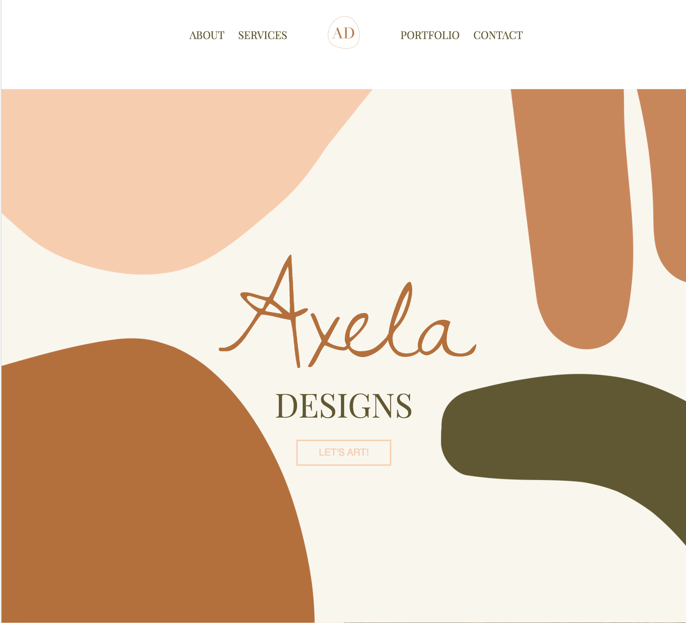
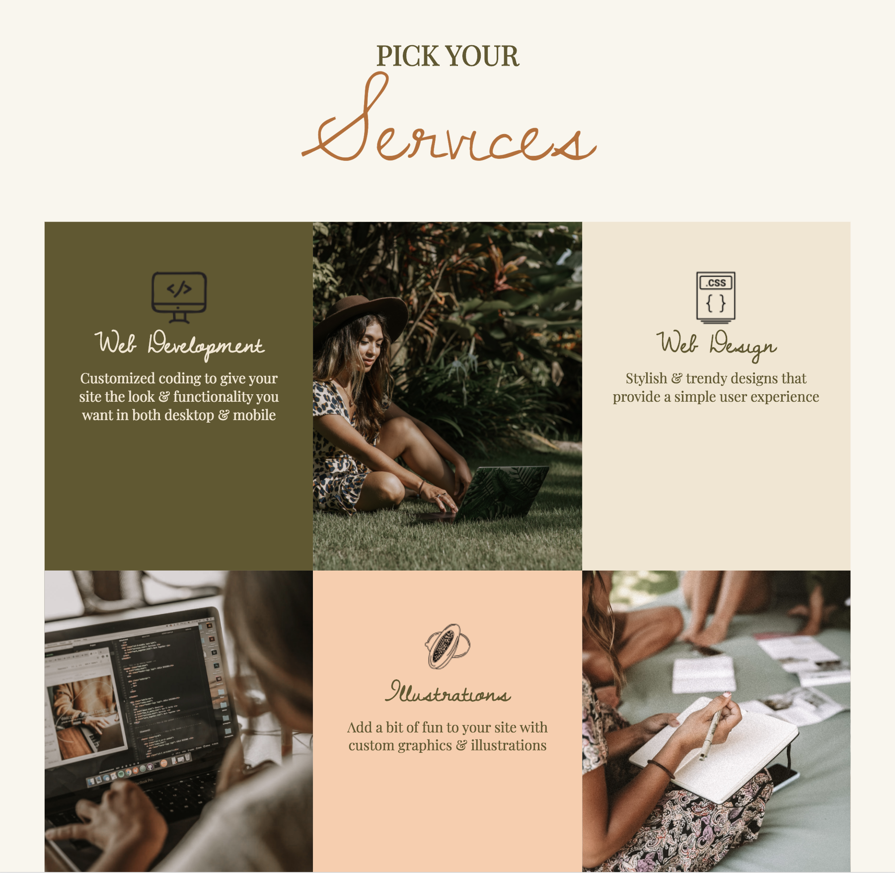
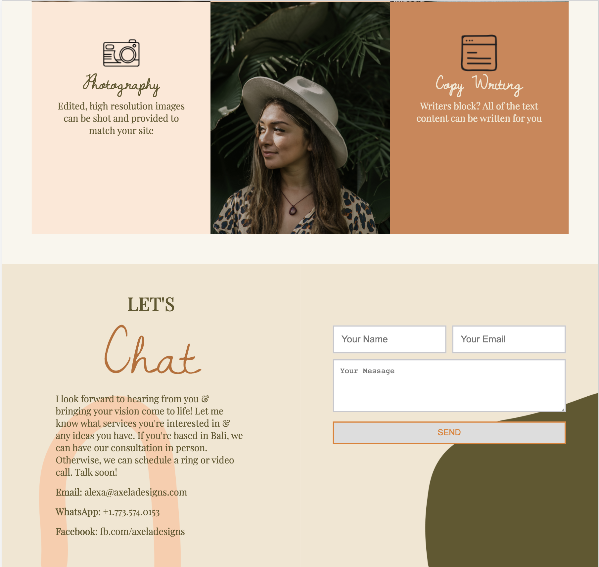

# Axela Designs 

A small business landing page with the basic about, services, contact sections that all one page sites need. Bohemian inspired with custom illustrations and designs. 

## Application Features
- Responsive web design
- Key website components for one page sites
- User can contact business owner 
- Custom design

[DEMO](https://www.youtube.com/watch?v=N85XSfltlGs)

## Built With
- Ruby framework Jekyll for multi page layout 
- Adobe Illustrator for illustrations
- CSS for styling

## Install Instructions
- Clone this repo to your local machine git clone
- install Jekyll gem 

## Future Implementations 
- Portfolio page to showcase work 
- Ability to schedule meetings

## Challenges 
What took the longest was settling on a design and merging all of the ideas I had into one cohesive design. However, this is also one of the fun parts!